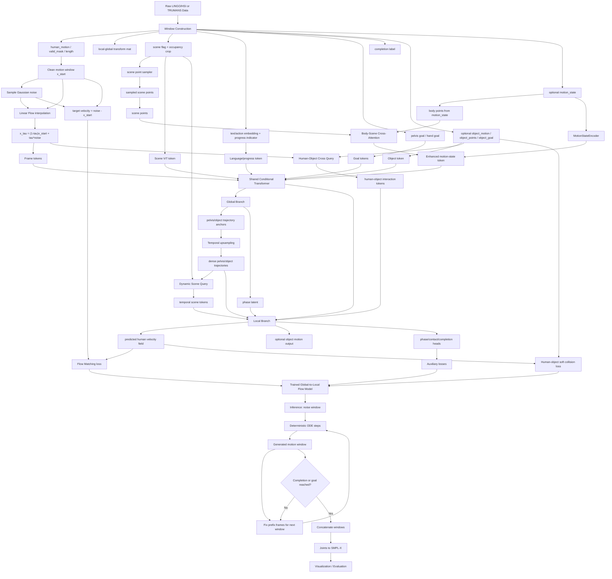

# FlowHSI Pipeline and Methodology

## 方法定位

当前项目实现的是一个 **goal-conditioned Flow Matching human-scene interaction motion generator**。生成范式由 `Sampler` 控制，默认配置见 `code/config/sampler/pelvis.yaml`：

- `objective: flow_matching`
- `timesteps: 50`
- `auto_regre_num: 2`
- `scene_type: occ_two`

模型主体是 `models.synhsi.Unet`，但这里的 `Unet` 不是卷积 U-Net，而是一个条件 Transformer window denoiser / velocity predictor。当前默认配置 `code/config/model/synhsi_body.yaml` 使用：

- `architecture: global_to_local`
- `dim_model: 512`
- `num_heads: 16`
- `num_layers: 8`
- `trajectory_anchor_stride: 4`
- `num_scene_query_frames: 8`
- `phase_dim: 32`
- `contact_dim: 6`

因此，当前方法可以概括为：

**在 autoregressive motion window 上训练一个条件速度场；模型先用 shared conditional Transformer 融合 motion、time、scene、language、goal、object 和 motion-state 条件。更新后的 motion-state 分支还可以进一步把 past body points 与 sampled scene points 通过 cross-attention 编码成 human-scene interaction embedding，再作为 condition 输入 global-to-local 速度场模型。**

代码里仍保留 DDPM 兼容路径，但当前训练和采样配置默认走 Flow Matching。

## 整体 Pipeline

整体 pipeline 包括：

1. LINGO/HSI 或 TRUMANS 数据构造成固定长度 window。
2. Sampler 对 clean motion window 和 Gaussian noise 做 linear flow interpolation。
3. `Unet` 接收 noisy/interpolated motion、time step 和多模态条件，预测 flow velocity。
4. 训练时使用 masked Flow Matching loss，并可选加入 pelvis trajectory、completion、smoothness 辅助损失。
5. 推理时从 Gaussian noise window 出发，执行 deterministic ODE sampling。
6. 每个 window 固定 prefix frames，生成后拼接为 autoregressive rollout。
7. 可选地用 motion-state branch 构造 body-scene interaction embedding，增强 scene-aware history condition。
8. 使用 completion head 或 locomotion goal distance 提前停止 segment。
9. 将 joints motion 转成 SMPL-X 参数，并用于可视化和评估。

## 1. Windowed Data Construction

项目现在支持两条数据路径。

### LINGO / HSI Window Dataset

`preprocess_window_dataset.py` 将 LINGO/HSI 原始序列预处理成固定长度 window，默认：

- window size: `16`
- step: `3`
- joints: `28`
- text feature: `768-D CLIP embedding`

每个样本包含：

- `human_motion`: local coordinate 下的 human joints，shape 为 `[T, J * 3]`
- `valid_mask` 和 `length`: 标记 window 内有效帧
- `mat`: local/global 坐标变换矩阵
- `scene_name` / `scene_flag`
- `text_emb`
- `pelvis_goal`
- `hand_goal`
- `is_pick`
- `need_scene`
- `need_pelvis_dir`
- `pi` 和 `need_pi`
- `object_present`
- `is_terminal_window` / `completion_label`
- 可选 `motion_state` 和 `motion_state_mask`

`motion_state` 是当前实现中新加的重要条件：它保存短边界历史，默认长度为 `4`，并由 `MotionStateEncoder` 编码成一个额外 condition token，用于增强 autoregressive window 之间的连续性。

在新的 body-scene interaction 设计中，`motion_state` 还可以作为 **body points source**：将最近若干 clean/generated history frames reshape 为 `[B, T_state * J, 3]` 的 body point set；再由 scene point sampler 从当前局部 scene occupancy 中采样 `[B, N_s, 3]` scene points，二者经过 cross-attention 得到 human-scene interaction embedding，并并入 motion-state condition。

### TRUMANS Raw Dataset Adapter

`datasets.trumans.TrumansDataset` 直接从 TRUMANS raw arrays 构造 window，默认：

- joints: `24`
- language/action feature: `10-D action_label`
- `load_object: true`

TRUMANS 路径额外构造 object 条件：

- `object_motion`: object translation + 6D rotation，维度为 `9`
- `object_points`: 从 `Object/*.npy` 采样的 object geometry points
- `object_goal`: object 的局部目标位置
- `object_present`: 当前 window 是否存在 object interaction

这些 object 条件会进入模型的 object token、state input 和 dynamic scene query。当前主训练 loss 仍然监督 human motion velocity；object branch 主要作为 human-object interaction 的结构化条件和中间预测。

## 2. Flow Matching Training Objective

训练时，真实 clean motion window 记为 `x_start`，Gaussian noise 记为 `noise`。Sampler 将离散 step `t` 映射为：

```text
tau = (t + 1) / timesteps
```

Flow Matching 插值为：

```text
x_tau = (1 - tau) * x_start + tau * noise
```

训练目标速度为：

```text
target velocity = noise - x_start
```

模型预测：

```text
v_theta(x_tau, t, condition)
```

代码里历史字段名仍叫 `pred_noise`，但当 `objective == flow_matching` 时，它实际表示 flow velocity，而不是 DDPM epsilon。

### Masking and Prefix Frames

训练会同时处理 prefix mask 和 valid-frame mask：

- `get_mask(... fixed_frame=auto_regre_num)` 固定前若干 prefix frames。
- invalid padded frames 不参与 loss。
- noisy input 中 prefix frames 会被强制替换回 clean `x_start`，保证模型学习在给定前缀条件下生成后续 motion。

因此 loss 只计算有效且非固定的 frame/channel。

### Auxiliary Losses

当 `use_aux_losses: true` 时，总 loss 为：

```text
total = denoise / flow_matching
      + w_pelvis * pelvis_traj_loss
      + w_completion * completion_loss
      + w_human_object * human_object_collision_loss
```

当前配置中：

- LINGO: `pelvis_traj=0.5`, `completion=0.2`, `human_object_collision=0`
- TRUMANS: `pelvis_traj=0.5`, `completion=0`, `human_object_collision=0.05`

其中 completion target 来自 `completion_label`；如果数据没有提供 label，则退化为 `length < max_window_size`。Human-object collision loss 使用 predicted clean motion 到 object point cloud 的最近点距离构造 soft margin penalty。

## 3. Current Model Architecture

当前默认模型是 `GlobalToLocalHOSIDenoiser`，核心结构如下。

### 3.1 Condition Tokens

模型首先构造 condition tokens。每个 token 都与 time embedding 相加：

- scene token: occupancy crop 经 ViT 编码得到
- language token: text/action embedding 加 progress indicator
- hand goal token: `GoalEncoder(mode="hand")`
- pelvis goal token: `GoalEncoder(mode="pelvis")`
- optional object token: PointNet-style object geometry encoder + object goal
- optional motion-state token: recent clean boundary history encoder
- optional body-scene interaction token: body points from `motion_state` + scene points from occupancy sampler, encoded by cross-attention

对于不需要的条件，代码会按 mask 置零，例如：

- `need_scene == false` 时 scene token 为零
- `need_pelvis_dir == false` 时 pelvis goal token 为零
- `is_pick == false` 时 hand goal token 为零
- `need_pi == false` 时 progress indicator 为零
- `object_present == false` 时 object token 和 object trajectory 为零

### 3.2 Motion-State Body-Scene Interaction Embedding

为了加入图中类似的 body-scene interaction embedding，最合适的位置是 motion-state 分支，因为它天然表示 **Past Human Motion**，并且训练/推理时都可获得。

该模块不使用当前 window 的完整 clean ground-truth motion，避免信息泄漏。输入定义为：

```text
body_points = reshape(motion_state)            # [B, T_state * J, 3]
scene_points = scene_point_sampler(scene_occ)  # [B, N_s, 3]
```

其中：

- `body_points` 来自 clean history。训练时是 GT 历史/边界帧；推理时是初始化姿态或已经生成出的历史帧。
- `scene_points` 不来自额外点云数据，而是从现有 scene occupancy 表达中采样。可以采样局部 occupied voxel centers、人体附近 surface-like voxels，或从当前 `occ_two` crop 中选取离 body/goal 最近的若干 occupied points。
- 两者都应位于当前 window 的 local coordinate 中，和 `motion_state`、`pelvis_goal`、`hand_goal` 的坐标系保持一致。

编码结构可以写成：

```text
body_feat  = MLP(body_points)
scene_feat = MLP(scene_points)

interaction_tokens = CrossAttention(
    query = body_feat,
    key   = scene_feat,
    value = scene_feat,
)

human_scene_interaction_emb = Pool(interaction_tokens)
```

最终有两种接法：

```text
motion_state_emb = MotionStateEncoder(motion_state)
interaction_emb  = BodySceneInteractionEncoder(body_points, scene_points)

enhanced_motion_state_emb = MLP(concat(motion_state_emb, interaction_emb))
```

或直接将 `interaction_emb` 作为额外 condition token：

```text
cond_tokens.append(t_emb + interaction_emb)
```

本文档建议第一种：**把 human-scene interaction embedding 并入 motion-state branch**。这样它语义上仍然是 history-aware condition，同时增强了 motion-state 对周围 scene geometry 的感知能力。

训练和推理的一致性非常重要：

- 训练时不能用当前 window 的完整 clean `x_start` 作为 body points condition。
- 推理时没有 GT，body points 应来自已经确定的 generated history。
- scene points 应由同一套 sampler 从 occupancy 中在线生成，保证训练/推理输入分布一致。

### 3.3 Shared Conditional Transformer

motion input 先被投影成 frame tokens。若 `load_object == true`，模型会把 `object_motion` 拼到 human motion 后一起作为 state input：

```text
state_input = concat(human_motion, object_motion)
```

随后模型将 condition tokens 和 frame tokens 拼接，加入 positional encoding，并送入 `nn.TransformerEncoder`。

该 shared Transformer 是所有条件融合的中心模块。

### 3.4 Global Branch

当 `architecture == global_to_local` 时，Transformer 输出的 frame tokens 会先进入 `GlobalBranch`：

- 每隔 `trajectory_anchor_stride` 帧取一次 anchor token。
- 预测 sparse `pelvis_traj_anchor`。
- 预测 sparse `object_traj_anchor`，并由 `object_present` mask 控制。
- 为每一帧预测 `phase_latent`。

随后 `temporal_upsample` 将 sparse anchors 线性上采样到 frame-level dense trajectory：

```text
pelvis_traj_dense: [B, T, 3]
object_traj_dense: [B, T, 3]
```

### 3.5 Dynamic Scene Query

`DynamicSceneQuery` 根据 global branch 预测出的 dense pelvis/object trajectory，从当前 occupancy crop 中按时间采样 scene features。

输入包括：

- `scene_grid`
- `pelvis_traj_dense`
- `object_traj_dense`
- query frame time
- `object_present`

它会在若干 query frames 上采样 pelvis/object 周围的 scene occupancy feature，再通过 MLP 得到 temporal scene tokens。也就是说，当前 scene conditioning 不只是一个静态 scene embedding，还包含了 **trajectory-conditioned dynamic scene query**。

Body-scene interaction embedding 与 `DynamicSceneQuery` 的作用不同：

- `DynamicSceneQuery` 根据预测出的 dense trajectory，在 scene crop 中按轨迹位置查询 scene feature。
- body-scene interaction embedding 根据 past body points 和 sampled scene points，在生成当前 window 前形成一个 history-scene relation condition。

两者可以同时存在。前者偏 trajectory-conditioned scene lookup，后者偏 past motion 与 surrounding scene 的 cross-attention relation。

### 3.6 Local Branch

### 3.6 Human-Object Cross Query

当 `load_object: true` 且 `use_human_object_cross_query: true` 时，模型会启用 `HumanObjectCrossQuery`。

该模块用 `object_points` / mesh samples 对当前 noisy/interpolated human motion 做最近点查询：

```text
for each frame and selected human joint:
    nearest_object_point = argmin_p || human_joint - object_point_p ||
```

然后编码三类局部几何特征：

- human joint 指向 nearest object point 的方向
- 最近 object point 距离
- `max(0, collision_margin - distance)` 的 margin violation

这些特征会被 MLP 投影成 frame-level human-object interaction tokens，并送入 Local Branch。它和 Dynamic Scene Query 的区别是：

- Dynamic Scene Query 建模 human/object 与 scene occupancy 的关系。
- Human-Object Cross Query 显式建模 human joints 与 object geometry points 的关系。

训练时还加入可配置的 soft collision loss：

```text
L_human_object_collision =
mean(max(0, margin - min_object_point_distance)^2)
```

该 loss 不需要完整 signed distance field，但能利用 object point cloud / mesh samples 减少人体关节与物体表面过近或重叠。

### 3.7 Local Branch

`LocalBranch` 将以下信息融合回每个 frame token：

- shared Transformer frame token
- dense pelvis/object trajectory
- dynamic scene tokens
- human-object cross tokens
- phase latent

融合后输出：

- `human_motion`: 在 Flow Matching 下代表 human velocity field
- `object_motion`: object motion branch 输出，并由 `object_present` mask 控制

当前默认返回给 sampler 的 `pred_noise` 是 `human_motion`。

### 3.8 Phase, Contact, Completion Heads

`PhaseContactTerminationHeads` 从 local frame tokens 预测：

- `phase_latent`
- `contact_logits`
- `completion_logits`
- `completion_prob`

completion head 使用最后一帧、mean pooling 和 max pooling 的 summary 进行 segment completion 判断。

## 4. Scene Conditioning

Sampler 在训练和采样时都会根据当前 motion state 构建 local occupancy crop。

对于默认 `scene_type: occ_two`：

1. 以当前 window 的 reference joint 位置为中心查询 scene occupancy。
2. 对需要 pelvis direction 的样本，再以 pelvis goal 位置查询第二个 occupancy crop。
3. 将两份 occupancy 沿 channel 维拼接。

因此模型既能看到当前局部环境，也能看到目标附近环境。该 occupancy crop 一方面经 ViT 形成 global scene token，另一方面作为 `DynamicSceneQuery` 的 `scene_grid` 被 trajectory-conditioned query 使用。

如果加入 body-scene interaction embedding，还需要在 scene conditioning 中增加一个 point sampling view：

```text
local occupancy crop -> scene point sampler -> scene_points
```

这里的 `scene_points` 是从 occupancy voxel 中得到的点集近似，而不是数据集原生提供的 point cloud。可选采样策略包括：

- 采样 occupied voxel centers。
- 优先采样 body/pelvis/hand 附近的 occupied voxels。
- 采样 pelvis goal 附近的 occupied voxels。
- 将 `occ_two` 的当前位置 crop 和目标 crop 都转成 candidate scene points。

这样可以把我们当前的 voxel scene 表达转成图中所需的 scene point set，再与 `motion_state` 提供的 body points 做 cross-attention。

## 5. Autoregressive ODE Sampling

推理时，Sampler 从 Gaussian noise window 开始：

```text
x_T ~ N(0, I)
```

然后从 `t = timesteps - 1` 反向迭代到 `0`。在 Flow Matching 模式下，每一步为 deterministic ODE update：

```text
x <- x - v_theta(x, t, condition) / timesteps
```

每一步更新后都会重新固定 prefix frames：

```text
x[:, :auto_regre_num] = fixed_points
```

默认 `auto_regre_num = 2`。生成一个 window 后：

- 当前 window 的末尾若干帧作为下一 window 的 prefix。
- `build_motion_state` 会从最近生成的 clean global motion 中构造 motion-state token。
- 如果启用 body-scene interaction embedding，同一个 `motion_state` 会 reshape 成 body points，并与当前局部 scene points 做 cross-attention，得到 enhanced motion-state condition。
- 对 locomotion segment，`sample.py` 使用 A* path 生成中间 pelvis goal。
- 对 interaction segment，hand goal、scene、text 和 progress indicator 继续作为条件控制。

这种方式让长序列由多个短 window 拼接得到，同时尽量维持边界连续性。

## 6. Completion-Aware Rollout

当前采样支持两类提前停止。

### Locomotion Stop

对于 locomotion segment，如果当前 pelvis 距离 segment end goal 小于：

```text
locomotion_threshold
```

则提前停止当前 segment。

### Completion Head Stop

对于非 locomotion segment，如果：

```text
completion_prob >= completion_threshold
```

并满足：

- `completion_min_step`
- `completion_patience`

则提前停止 segment。

默认采样配置中：

- `use_completion_stop: true`
- `completion_threshold: 0.7`
- `completion_min_step: 2`
- `completion_patience: 1`

采样输出会保存每个 window 的 `completion_prob` 和 `completion_stop_reason`。

## 7. SMPL-X Conversion and Evaluation

生成结果首先是 joints motion。`sample.py` 会调用：

```text
joints_to_smpl(model_joints_to_smplx, keypoint_gene_torch, joints_ind, interp_s)
```

该步骤包括：

1. 对 joints 做 temporal interpolation。
2. 预测 SMPL-X 6D rotation 参数。
3. 转成 axis-angle。
4. 通过 SMPL-X optimization 拟合 body pose 和 translation。

最终输出 pickle 中包含：

- `joints`
- `transl`
- `body_pose`
- `global_orient`
- `scene_name`
- `raw_text`
- `completion_prob`
- `completion_stop_reason`

评估脚本 `evaluation.py` 支持：

- interaction metrics
- locomotion metrics
- reaching / contact precision / recall / F1
- scene penetration
- foot sliding
- FID / Diversity / Precision 等 evaluator-space 指标

## Pipeline Flowchart



## 一句话总结

当前项目的核心方法是：**把 human-scene interaction motion generation 建模为 goal-conditioned Flow Matching，在 fixed-length autoregressive windows 上学习从 noisy motion 到 clean interaction motion 的条件速度场；模型架构由 shared conditional Transformer、global trajectory branch、dynamic scene query、local motion branch 和 completion/contact/phase heads 组成，并通过 prefix frames、motion-state token，以及可加入 motion-state 分支的 body-scene cross-attention interaction embedding 支持更稳定的长序列 scene-aware rollout。**
