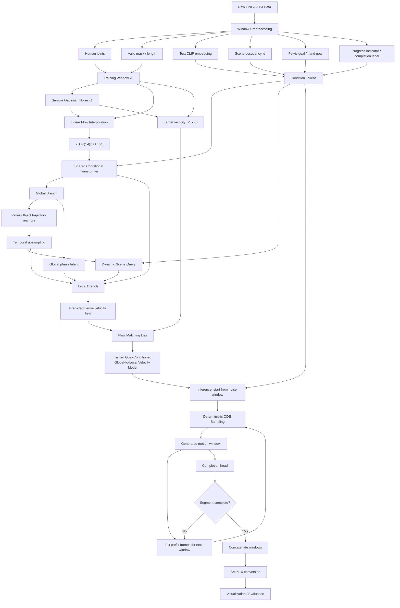

# FlowHSI Pipeline and Methodology

## 方法定位

我们当前的方法可以描述为一个 **goal-conditioned Flow Matching human-scene interaction motion generator**。

项目的重心不再是 general-purpose world model，而是：给定场景、语言、人体初始状态、pelvis goal、hand goal 和 progress condition，模型学习一个从噪声运动窗口流向目标交互动作窗口的条件速度场。

换句话说，我们把 human-scene interaction motion synthesis 从“随机反向扩散生成”转化为 **受目标和场景约束的连续速度场学习问题**，利用 Flow Matching 的确定性 ODE 采样获得更快、更平滑、更适合 goal-conditioned autoregressive motion rollout 的生成过程。

## Pipeline 文字描述

整体 pipeline 包括数据窗口化、Flow Matching 训练、global-to-local 运动结构建模、autoregressive ODE 采样、completion-aware rollout、SMPL-X 转换与评估。

### 1. Windowed Data Construction

首先，我们将完整的 LINGO/HSI 人体动作序列切成固定长度的 autoregressive windows。

每个 window 包含以下信息：

- Human joints motion
- Valid-frame mask 和 motion length
- Scene id / scene occupancy condition
- Text CLIP embedding
- Pelvis goal
- Hand goal
- Progress indicator
- Completion / terminal label

这些信息共同构成模型的多模态条件输入，使模型不仅生成合理动作，还能生成满足场景、语言和目标约束的动作。

### 2. Goal-Conditioned Flow Matching Training

训练阶段中，真实动作窗口记为 `x0`，高斯噪声窗口记为 `x1`。模型在二者之间采样一个中间状态：

```text
x_t = (1 - t) x0 + t x1
```

对应的 Flow Matching 目标速度为：

```text
target velocity = x1 - x0
```

模型输入 `x_t`、时间 `t` 以及多模态条件，预测当前状态应该沿哪个速度方向移动。

因此，模型不是学习 DDPM 中每一步的随机去噪噪声，而是直接学习一个条件速度场：

```text
v_theta(x_t, t, condition)
```

这个速度场描述了 noisy motion window 如何流向满足 scene、text、pelvis goal、hand goal 和 progress condition 的目标 motion window。

### 3. Global-to-Local Motion Architecture

我们当前仍然保留并默认启用 **global-to-local 支路设计**。配置中 `architecture: global_to_local`，因此模型不是单纯的 flat transformer denoiser。

具体来说，模型结构可以分为三层：

- Shared conditional transformer：先融合 noisy motion tokens、time embedding、scene condition、language condition、pelvis goal、hand goal 和 progress indicator。
- Global branch：从 frame tokens 中预测稀疏的全局结构，包括 pelvis trajectory anchors、object trajectory anchors 和 global phase latent。
- Dynamic scene query：根据 global branch 预测出的 pelvis/object dense trajectory，在场景 occupancy 中查询随时间变化的 scene tokens。
- Local branch：结合 frame tokens、global trajectory、dynamic scene tokens 和 phase latent，生成最终 dense human motion / object motion。

因此，Flow Matching 是我们的生成范式，global-to-local 是我们的运动结构建模方式。二者不是互斥关系：模型通过 Flow Matching 学习条件速度场，而速度场内部由 global branch 先决定粗粒度轨迹与阶段，再由 local branch 生成细粒度姿态和交互动作。

### 4. Autoregressive ODE Sampling

推理阶段从随机噪声 window 开始，通过 deterministic ODE step 逐步生成动作：

```text
x <- x - v_theta(x, t, condition) / num_steps
```

每个 window 生成时，会固定前若干帧作为 prefix frames，用于保持和前一个窗口的动作连续性。

生成一个窗口后，当前窗口的末尾帧会作为下一个窗口的 prefix，形成 autoregressive rollout。

对于不同任务，条件控制方式包括：

- Locomotion：结合 A* path guidance 生成中间 pelvis goal
- Interaction：使用 hand goal 引导接触或交互动作
- Scene-aware motion：通过 scene occupancy condition 避免明显穿模
- Language control：使用 text CLIP embedding 控制动作语义
- Progress control：通过 progress indicator 控制动作阶段

### 5. Completion-Aware Rollout

模型额外包含 completion head，用于预测当前 window 是否已经完成目标 segment。

推理时，如果 completion probability 超过阈值，则当前 segment 可以提前停止。这可以减少 autoregressive 拼接中的冗余窗口，并降低由随机反向过程带来的终止不稳定性。

### 6. SMPL-X Conversion and Evaluation

最终生成的 joints motion 会被转换为 SMPL-X 参数，用于 Blender 可视化和后续评估。

评估指标包括：

- Interaction quality
- Locomotion quality
- Reaching accuracy
- Scene penetration
- Foot sliding
- Diversity / FID / Precision / Recall / F1

## 为什么 Flow Matching 适合当前任务

### 1. 更快的窗口采样

我们的任务是 autoregressive window rollout，每个动作都需要一窗一窗生成。

如果使用 DDPM，每个 window 都要执行较长的随机反向扩散链，采样代价较高。Flow Matching 使用 ODE 采样，默认 50 steps，并且后续可以进一步尝试 25 steps，从而直接降低每个 window 的生成时间。

### 2. 更少的随机抖动

DDPM 在反向过程的每一步都包含随机噪声，这在 window 拼接时容易带来动作滑动、抖动或不连续。

Flow Matching 在推理阶段使用 deterministic velocity field，采样轨迹更加稳定，因此更适合 autoregressive motion stitching。

### 3. 更适合 Goal-Conditioned Motion

我们的任务不是无条件随机动作生成，而是强约束动作生成。

生成结果必须同时满足：

- Scene condition
- Text condition
- Pelvis goal
- Hand goal
- Progress condition
- Prefix-frame continuity

Flow Matching 学习的是从噪声流向目标动作的速度场，目标约束可以更直接地作为 condition 注入模型。

### 4. 更方便加入 Guidance

Flow Matching 的 ODE 采样过程便于在每一步加入额外修正项，例如：

- Collision guidance
- Contact guidance
- Sofa / object arrival guidance
- Hand-object interaction guidance
- Pelvis trajectory guidance

这比在随机 DDPM 反向过程中插入稳定控制更直接。

### 5. Completion Head 更稳定

由于 Flow Matching 的采样轨迹更平滑，completion probability 不容易被随机反向扩散过程扰乱。

这使得 segment-level stopping 更稳定，也更适合长序列 autoregressive generation。

## Pipeline Flowchart



## 一句话总结

我们的核心方法是：**将 human-scene interaction motion generation 建模为 goal-conditioned Flow Matching 问题，通过学习条件速度场和确定性 ODE 采样，实现更快、更稳定、更适合长序列窗口拼接的交互动作生成。**
